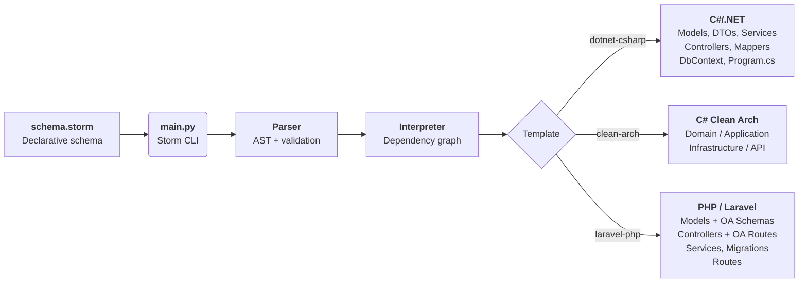

<p align="center">
  
</p>

<h1 align="center">⚡ API Starter Kit</h1>
<p align="center"><strong>Declare your data model once. Generate everything.</strong></p>

<p align="center">
  
  
  
  
</p>

---

A CLI tool that scaffolds full‑stack API projects from a **declarative schema file**.  
Write your data model in `.storm` format and get complete, production‑ready backend code — controllers, services, models, DTOs, migrations, OpenAPI annotations — in **C# (.NET)** or **PHP (Laravel 12+)** with zero boilerplate.

---

## 📦 Quick Start

```bash
# 1. Install Python dependencies
pip install -r requirements.txt

# 2. Scaffold a project (pick your template)
python main.py --init --template dotnet-csharp --name MyApi          # .NET
python main.py --init --template laravel-php                         # Laravel

# 3. Edit schema.storm to define your data model

# 4. Generate all source files
python main.py --generate
```

---

## 🧭 Commands

| Flag | Alias | Description |
|------|-------|-------------|
| `--init` | `-i` | Scaffold a new project from a template |
| `--generate` | `-g` | Regenerate all source files from `schema.storm` |
| `--template` | `-t` | Template: `dotnet-csharp`, `dotnet-csharp-clean-architecture`, or `laravel-php` |
| `--name` | `-n` | Project name (defaults to current folder name) |

---

## 🏗️ Templates

| Template | Stack | ORM | Auth |
|----------|-------|-----|------|
| `dotnet-csharp` | ASP.NET Core Web API | EF Core (SQL Server) | ASP.NET Identity |
| `dotnet-csharp-clean-architecture` | Clean Architecture (Domain → Application → Infrastructure → API) | EF Core (SQL Server) | ASP.NET Identity |
| `laravel-php` | Laravel 13+ · PHP 8.5+ | Eloquent | — (pkg ready) |

---

## 📐 Schema Language (`.storm`)

Define your entire data model in a clean, readable syntax — one file, no ceremony.

```storm
// ═══ Enums ═══════════════════════════════════════════════════════════════

enum Status {
    Active   = "active",
    Inactive = "inactive",
    Pending  = "pending"
}

enum Role {
    Admin = "admin",
    User  = "user"
}

// ═══ Tables ═════════════════════════════════════════════════════════════

table User {
    id:        uuid pk;
    name:      string(min=2, max=100);
    email:     string(max=255) unique;
    password:  string(max=255);
    role:      Role;
    status:    Status;
    createdAt: datetime;
    updatedAt: datetime;
}

table Product {
    id:        int? pk;
    name:      string(min=1, max=200);
    price:     double(min=0) = 0;
    stock:     int(min=0) = 0;
    status:    Status;
    ownerId:   uuid;
    owner:     User;            // ← FK: BelongsTo User
    createdAt: datetime;
    updatedAt: datetime;
}
```

### 🔤 Type System

| Storm Type | C# | PHP / OA | Migration | Notes |
|------------|-----|----------|-----------|-------|
| `int` | `int` | `integer` | `integer` | Supports `pk`, `unique`, `min`, `max` |
| `long` | `long` | `integer` | `bigInteger` | |
| `float` | `float` | `number` | `float` | |
| `double` | `double` | `number` | `double` | |
| `string` | `string` | `string` | `string` | Supports `min`, `max` |
| `bool` | `bool` | `boolean` | `boolean` | |
| `uuid` | `Guid` | `string` | `uuid` | |
| `datetime` | `DateTime` | `string` (date‑time) | `dateTime` | |

- Append `?` for nullable: `int?`, `uuid?`
- Reference another table → **foreign key** (BelongsTo / HasMany generated automatically)
- Reference an enum → typed enum column with casts
- Default values support **constant expressions**: `price:double = 0`, `qty:int = 5 * 4`

### 🧮 Expressions

Constant expressions in default values are evaluated at parse time:

| Expression | Result |
|------------|--------|
| `5 * 4` | `20` |
| `(1 + 2) * 3` | `9` |
| `-5` | `-5` |
| `!true` | `false` |

---

## 🎯 Generated Artifacts

### .NET (`dotnet-csharp` / clean‑architecture)

| File | Path | Description |
|------|------|-------------|
| `{Entity}.cs` | `Models/` | Entity class (User extends `IdentityUser`) |
| `{Entity}RequestDto.cs` | `Dtos/` | Create / update payload |
| `{Entity}ResponseDto.cs` | `Dtos/` | Full API response |
| `{Entity}ResponseSimplifiedDto.cs` | `Dtos/` | Lightweight response (no FK expansion) |
| `I{Entity}Service.cs` | `IServices/` | Interface: CRUD + FK + Enum pagination |
| `{Entity}Service.cs` | `Services/` | EF Core + AutoMapper implementation |
| `{Entity}Controller.cs` | `Controllers/` | REST API with Swagger + Scalar annotations |
| `{Entity}MappingProfile.cs` | `Mappers/` | AutoMapper profile |
| `Program.cs` | `/` | App bootstrap: Identity, DbContext, AutoMapper, Scrutor, Scalar |
| `AppDbContext.cs` | `Data/` | EF Core context with `DbSet<T>` |

Shared base files (once):

| File | Description |
|------|-------------|
| `IGenericService.cs` | Generic CRUD interface |
| `GenericService.cs` | Generic EF Core implementation |
| `GenericController.cs` | Generic REST controller |
| `PaginatedResult.cs` | Pagination DTO + extension |
| `PaginateQuery.cs` | Query parameters: `page`, `rows` |

**Clean Architecture** maps the same files into namespace‑aware paths:  
`Domain/`, `Application/`, `Infrastructure/`, `API/`.

### Laravel PHP

| File | Path | Description |
|------|------|-------------|
| `{Entity}.php` | `app/Models/` | Eloquent model with `#[OA\Schema]` annotations |
| `{Entity}Controller.php` | `app/Controllers/` | Full CRUD with `#[OA\Get/Post/Put/Delete]` |
| `{Entity}Service.php` | `app/Services/` | Pagination, CRUD, FK & enum filters, validation rules |
| `{Enum}.php` | `app/Static/` | PHP 8.1+ backed enum with `#[OA\Schema]` |
| `Controller.php` | `app/Controllers/` | Base controller with `ok()`, `notFound()` + shared OA schemas |
| `*_create_*_table.php` | `database/migrations/` | Schema migration with FK cascades |
| `api.php` | `routes/` | All RESTful routes including FK & enum filter endpoints |

---

## 🔗 Auto‑Generated Endpoints

For a `Product` table with FK `owner:User` and enum `status:Status`:

### C#
| Method | Route | Description |
|--------|-------|-------------|
| `GET` | `/api/Product` | Paginated list (search, filter, page, rows) |
| `GET` | `/api/Product/{id}` | Single item by ID |
| `GET` | `/api/Product/user/{ownerId}` | Paginated list filtered by User |
| `GET` | `/api/Product/status/{status}` | Paginated list filtered by Status |
| `POST` | `/api/Product` | Create |
| `PUT` | `/api/Product/{id}` | Update |
| `DELETE` | `/api/Product/{id}` | Delete |

### PHP
| Method | Route | Description |
|--------|-------|-------------|
| `GET` | `/api/product` | Paginated list |
| `GET` | `/api/product/{id}` | Single item |
| `GET` | `/api/product/user/{ownerId}` | Filtered by User |
| `GET` | `/api/product/status/{status}` | Filtered by Status |
| `POST` | `/api/product/create` | Create |
| `PUT` | `/api/product/update/{id}` | Update |
| `DELETE` | `/api/product/delete/{id}` | Delete |

---

## 📁 Project Structure

```
apistarterkit/
├── main.py                    # CLI entry point
├── storm.config.json          # Project config (auto‑generated)
├── schema.storm               # Your data model (edit this!)
├── requirements.txt           # Python deps
│
├── src/                       # Core engine
│   ├── interpreter.py         # Code generator (C# + PHP)
│   ├── parser.py              # Recursive‑descent parser
│   ├── tokenizer.py           # Lexer
│   ├── ast.py                 # AST node types
│   ├── enum.py                # Enum AST handler
│   ├── table.py               # Table AST handler
│   ├── column.py              # Column type system
│   ├── template.py            # Template enum
│   ├── error_handler.py       # Formatted error reporting
│   ├── keyword.py             # Language keywords
│   ├── tok_type.py            # Token type enum
│   ├── tok.py                 # Token class
│   ├── pos.py                 # Position tracking
│   ├── generic_controller_csharp.py
│   ├── generic_service_csharp.py
│   ├── generic_mapper_csharp.py
│   ├── generic_pagination_csharp.py
│   └── generic_query_chsarp.py
│
├── tests/                     # Test suite (148 tests)
│   ├── conftest.py
│   ├── test_codegen.py        # Template output tests (70)
│   ├── test_parser.py         # Parser correctness (33)
│   ├── test_tokenizer.py      # Lexer correctness (26)
│   ├── test_error_handler.py  # Error formatting (5)
│   └── test_integration.py    # End‑to‑end parse (7)
│
└── pyvenv/                    # Python virtual environment
```

---

## 📦 Dependencies

### C# (.NET)

Auto‑installed during `--init`:

| Package | Purpose |
|---------|---------|
| `Microsoft.EntityFrameworkCore` | ORM |
| `Microsoft.EntityFrameworkCore.SqlServer` | SQL Server provider |
| `Microsoft.EntityFrameworkCore.Design` | Migrations |
| `Microsoft.AspNetCore.Identity.EntityFrameworkCore` | ASP.NET Identity |
| `AutoMapper` | Object mapping |
| `Scrutor` | Assembly scanning / DI |
| `Scalar.AspNetCore` | OpenAPI UI |

### PHP (Laravel)

Auto‑installed during `--init`:

| Package | Purpose |
|---------|---------|
| `laravel/framework` | Core framework (`^13.0`) |
| `zircote/swagger-php` | OpenAPI attribute annotations |
| `spatie/laravel-query-builder` | Eloquent query builder |

---

## ✅ Requirements

| Dependency | Version | Required For |
|------------|---------|--------------|
| Python | 3.10+ | CLI runtime (all templates) |
| .NET SDK | 8.0+ | `dotnet-csharp`, `dotnet-csharp-clean-architecture` |
| EF Core CLI | `dotnet-ef` | `dotnet-csharp`, `dotnet-csharp-clean-architecture` |
| PHP | 8.5+ | `laravel-php` |
| Composer | — | `laravel-php` |

---

## 🧪 Testing

```bash
# Full suite (148 tests)
python -m pytest tests/ -q

# Code‑generation only
python -m pytest tests/test_codegen.py -v

# With coverage
python -m pytest tests/ --cov=src
```

---

## ⚙️ Workflow



---

## 📄 License

MIT — see [LICENSE](./LICENSE).
